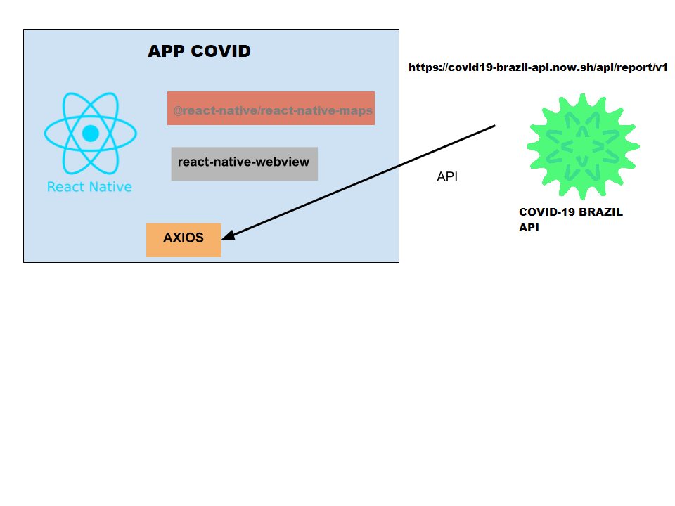

# AppCorona

**Objetivo**
| Dar acesso as informações sobre dados do corona virus atraves de um aplicativo.

**Justificativa**
| Este projeto faz parte das atividades avaliativas do curso de desenvolvimento de sistemas para dispositivos móveis do curso de DS do SENAI.

**Arquitetura**

**Tecnologias**
- [Java Script](https://www.javascript.com/)
- [React Native](https://facebook.github.io/react-native/)
- [Expo](https://docs.expo.io)
- [Axios](https://github.com/axios/axios)

**Autor**
Foto | Nome | GitHub | Likedin | E-mail
---- | ---- | ------ | ------- | ------
  | Silvestre Carlos Elioterio Neto | [Elioterio2002](https://github.com/elioterio2002) | [Linkedin](https://www.linkedin.com/in/silvestre-carlos-75baaa1b1/) | elioterio2002@gmail.com

**Comandos**
Você precisa instalar o [Node.js](https://nodejs.org/en/download/) e o [Expo](https://docs.expo.io) primeiro e, em seguida clone o repositório.

1. Execute `npm install` para instalar as dependências;
2. Execute `npm start` para iniciar o aplicativo;